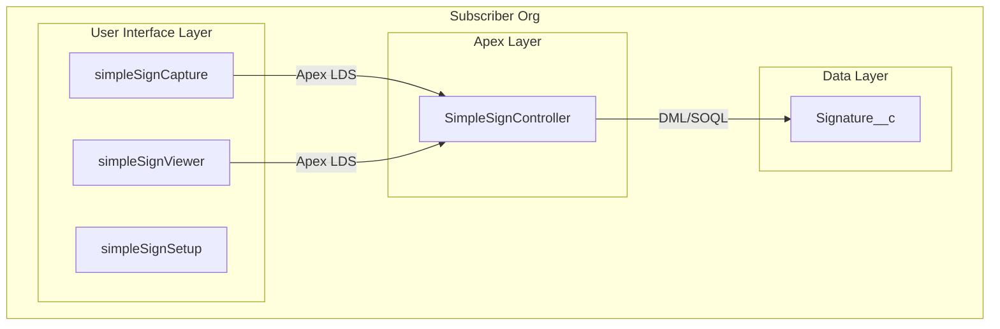

# Simple Sign — Solution Architecture and Usage

> Document for Security Review submission. Describes information flow, authentication, encryption, data touchpoints, and basic usage.

---

## 1. Architecture Overview

Simple Sign is a 100% native Salesforce managed package. All components run within the Salesforce Platform. No external systems, APIs, or third-party services are involved.

---

## 2. Information Flow

### 2.1 Signature Capture Flow

1. **User draws signature** on HTML5 Canvas in `simpleSignCapture` (client-side, browser memory only).
2. **User clicks Save** — component converts canvas to base64 PNG data URL (`data:image/png;base64,...`).
3. **LWC calls** `SimpleSignController.saveSignature(base64Image, relatedFieldName, parentRecordId)` via Apex LDS (Lightning Data Service).
4. **Apex validates** inputs (non-blank, valid format, CRUD/FLS checks, lookup field existence).
5. **Apex inserts** `Signature__c` record with `SignatureImage__c` = base64 string.
6. **Response** returns new record Id to LWC; LWC shows success toast.

**Data touchpoints:**
- Browser memory (canvas) → LWC JavaScript
- LWC → Apex (parameters passed by Salesforce framework)
- Apex → Signature__c (DML insert)
- Response: Apex → LWC (record Id)

### 2.2 Signature Display Flow

1. **User opens page** with `simpleSignViewer` (e.g., on a record with a signature lookup).
2. **LWC calls** `SimpleSignController.getLatestSignature(relatedFieldName, parentRecordId)` (cacheable).
3. **Apex executes** parameterized SOQL (`String.escapeSingleQuotes` for dynamic field name) against `Signature__c`.
4. **Response** returns `{ id, signatureImage, createdDate, createdByName }` to LWC.
5. **LWC renders** image from base64 string, date, and signer name.

**Data touchpoints:**
- Apex → SOQL query → Signature__c
- Apex → LWC (Map result)
- LWC → DOM (image, text)

---

## 3. Authentication

**Salesforce Platform Authentication Only**

- Users authenticate via standard Salesforce login (username/password, SSO, or Experience Cloud guest/authenticated).
- No OAuth tokens, API keys, or external credentials are used or stored.
- Apex controller uses `with sharing` — all queries and DML respect the current user's profile, permission sets, and org-wide defaults.
- LWC-to-Apex calls are authenticated by the Salesforce session; no custom authentication logic.

---

## 4. Encryption and Data Transfer

### 4.1 Data in Transit

- All traffic between the browser and Salesforce uses **HTTPS (TLS)**. This is enforced by the Salesforce Platform; Simple Sign does not implement custom transport.
- LWC-to-Apex communication goes through Salesforce's internal LDS framework over the same HTTPS connection.

### 4.2 Data at Rest

- Signature images are stored as base64 text in `Signature__c.SignatureImage__c` (Long Text Area).
- Data resides in the subscriber's Salesforce org, subject to standard Salesforce data residency and encryption at rest (platform-managed).

### 4.3 No External Transfer

- No data is sent to external endpoints.
- No HTTP callouts, external APIs, or third-party services.

---

## 5. Data Touchpoints Summary

| Touchpoint | Data | Direction | Security |
|------------|------|-----------|----------|
| Canvas → LWC | Base64 PNG | In-memory (browser) | Client-side only |
| LWC → Apex | base64Image, relatedFieldName, parentRecordId | HTTPS (LDS) | Session auth |
| Apex → Signature__c | Insert/Select | Platform DML/SOQL | CRUD/FLS enforced |
| Apex → LWC | Record Id or signature data | HTTPS (LDS) | Session auth |
| LWC → User | Rendered image, metadata | DOM | Read-only display |

---

## 6. Security Controls

- **CRUD/FLS**: All DML uses `AccessLevel.USER_MODE` (platform-enforced CRUD/FLS). All SOQL uses `AccessLevel.USER_MODE` (platform-enforced object and field accessibility).
- **Sharing**: `with sharing` ensures row-level security.
- **Input validation**: Parent ID format (`Id.valueOf`), lookup field existence and type, base64 format prefix.
- **SOQL injection**: Dynamic field names use `String.escapeSingleQuotes()`.
- **No guest DML by default**: Signature creation requires authenticated user with permission set (unless org grants guest access to Signature__c).

---

## 7. Basic Usage Instructions

### Installation

1. Install the Simple Sign managed package from AppExchange.
2. Assign the **Simple Sign User** or **Simple Sign Admin** permission set to users.
3. (Optional) Add a lookup field on `Signature__c` to link signatures to a parent object (e.g., `Account__c`, `Contact__c`).

### Capture a Signature

1. Edit a Lightning record page (or App page, Home page, Flow, Experience Cloud page).
2. Drag **Simple Sign Capture** onto the page.
3. Configure **Parent Record ID** (e.g., `{!recordId}`) and **Lookup Field API Name** if linking to a parent.
4. Save and activate the page.
5. User opens the page, draws a signature, clicks **Save**. The signature is stored and linked (if configured).

### Display a Signature

1. Add **Simple Sign Viewer** to a page (e.g., on a parent record page or a Signature record page).
2. On a Signature record page: leave Lookup Field empty.
3. On a parent record page: set **Lookup Field API Name** to the field linking Signature to that object.
4. User sees the latest signature for the current record.

### Setup Guide

- Use the **Simple Sign Setup** tab (or LWC on an App page) for step-by-step post-installation configuration.

---

## 8. Components Inventory

| Component | Type | Purpose |
|-----------|------|---------|
| simpleSignCapture | LWC | Signature drawing and save |
| simpleSignViewer | LWC | Read-only signature display |
| simpleSignSetup | LWC | Post-installation setup wizard |
| SimpleSignController | Apex | saveSignature, getLatestSignature |
| Signature__c | Custom Object | Storage for signature records |
